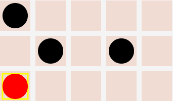
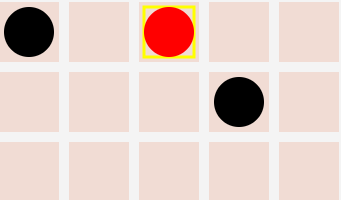
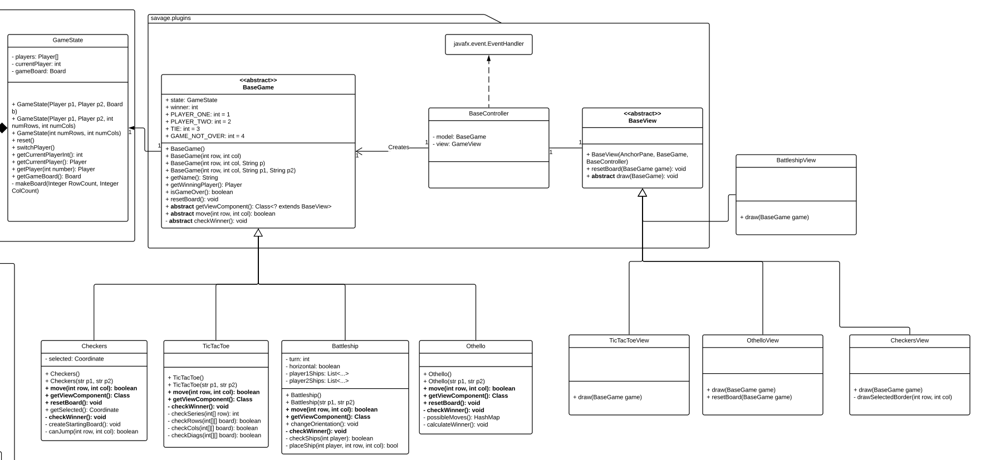
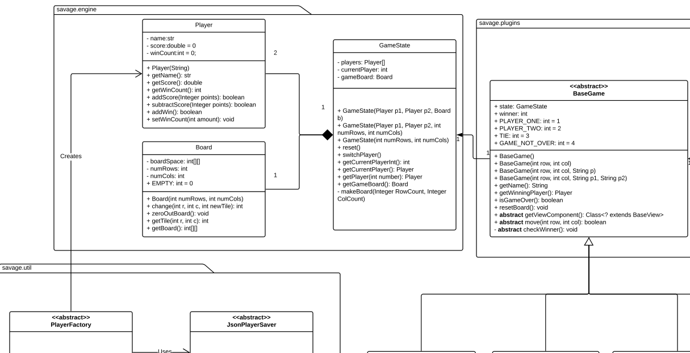
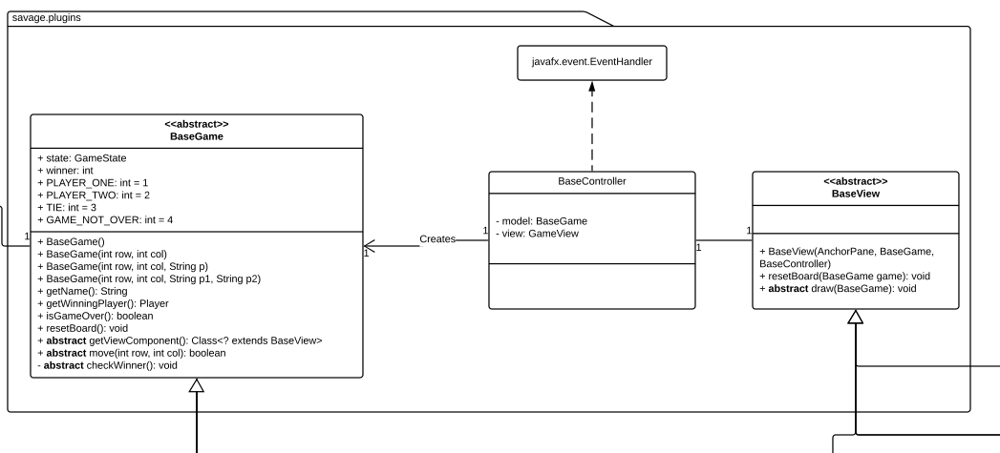
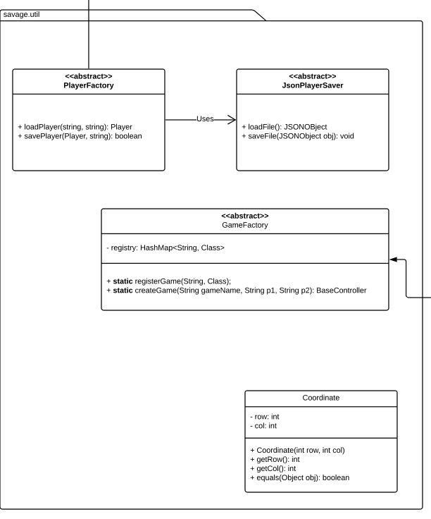

# Savage

In general some of the high points included gaining experience using github at a large scale as well as using javafx scene builder. It took some thought to implement the game engine so that games could be added easily however once it was completed we all felt very accomplished. 

One of the major low points of this project would be how many people were included in the group. Coordinating schedules and communicating with this many people was definitely challenging however through the use of slack, group messaging, google hangouts, and github we were able to to increase our communication efficiency and were able to resolve any possible meetup/understanding conflicts. 

## Terminology

|Term|Definition|
|---|--------------|
|BGE|Board Game Environment|
|Cell|A place in the two-dimensional board that will have a single unit inside. e.g. in TicTacToe there are _9_ total cells.|
|State|Refers to GameState object that will be inside BaseGames. Includes all raw data in the game.|

## For Users
Under the package `inf122` lies 4 fully implemented games integrated with a `javafx.Application` under the class `inf122.gui.Savage`. 

### Initial Run
Below is an image of the launch screen for Savage Demo Application. Users are not authenticated, and to create _or_ load a user, simply enter the name under the corresponding fields in the main screen.


For more details on how users are stored, see **Creating Users** below.

Below are clarifying interactions for two of the games, **Checkers** and **Battleships** due to their unique nature in operating the game. The other two are straightforward point-and-click mechanic.

### Checkers Game
The _Checkers_ game does _NOT_ use a "Drag and drop" mechanic for making the move. Instead, a move is made with two mouse clicks: the first choosing which piece should be moved, and the second being the location it should move to.

> When you select a piece, a yellow border will appear around that piece. You are still able to choose a separate piece to play; simply select the other piece and it will change.






### Battleships Game
Player one places ships first (they can rotate ships to horizontal with rotate button at the bottom). Once player one has placed five ships, it is player two’s turn to place ships. They also place five ships (and can rotate them with the same button). From then on, player one and two alternate turns placing guesses on their opponent’s board to sink each others ships.


### Creating Users
Launching this class either directly or under a Jar for the first time will create a `player-data.json` file under the same directory as the launching location.

Here is an example of the file:
```json
{
  "facility": {
    "othello": 15,
    "tictactoe": 4
  },
  "gvkhacha": {
    "tictactoe": 2,
    "battleships": 1
  }
}
```

The JSON file is structured as follows:
```json
{
    "Player Name":{
        "Game Name": <Number of Wins>    
    }
}
```

## For Game Creators
Game creators should only be concerned with the package `inf122.savage.plugins` and extending the classes under that.  Do _not_ be concerned with creating objects from the following classes:
* Player
* Board
* GameState
* BaseGame
* BaseView

See **Creating a GUI** for how to create Controller objects (and thus, the rest of the game).




### Creating a Game
To create a game, we recommend creating two classes for a game: the _Model_ and _View_ which relates to the popular [Model-View-Controller](https://en.wikipedia.org/wiki/Model%E2%80%93view%E2%80%93controller) design pattern.

#### The Model
The model should extend from abstract class `inf122.savage.plugins.BaseGame` which implements basic methods, but the following methods are required to be implemented

* `boolean move(int row, int col)` : Will be called every time the user clicks on a grid piece on the board. Unless BaseController is changed, this is the interaction you must follow
* `Class<? extends BaseView> getViewClass()` : Should return the class for the view that should be used, so that it could be created later by the Controller.
    - For example, TicTacToe model should return `TicTacToeView.class`, where _TicTacToeView_ is a class that extends BaseView.

#### The View
The view should extend from abstract class `inf122.savage.plugins.BaseView`, which only implements drawing a basic frame of the board. The following method _must_ be overridden.

* `void draw(BaseGame game)` : Will be called every time a valid move was made, or a change in the board has been detected by the Controller. 
* To re-draw the board entirely (erasing all contents on the Canvas) use `BaseView.resetBoard(BaseGame game)`

To actually implement the `draw` method, it is important to note that BaseView by default creates a series of [Canvas]() objects on the Pane it was assigned. It is placed in a two-dimensional grid-like fashion, and will act as the game board. To draw something on the board, you must get the `Canvas` corresponding to the row and column for the cell using `BaseView.getCanvasAt(int row, int column)`.

With this Canvas object, be sure to follow [JavaFx methods for drawing](https://docs.oracle.com/javase/8/javafx/api/javafx/scene/canvas/Canvas.html) and using `Canvas.getWidth()` and `Canvas.getHeight()`. 


### Creating the GUI
Savage currently only fully supports [JavaFx](https://docs.oracle.com/javase/8/javafx/get-started-tutorial/jfx-overview.htm) applications, restricted by the classes `inf122.savage.plugins.BaseView` and `inf122.savage.plugins.BaseController`. 

To create a game inside a JavaFx scene, we recommend using `inf122.savage.util.GameFactory` to create the Controller and corresponding Model and View for the game.

```java
        BaseController controller = GameFactory.createGame(gameName, p1Name, p2Name);
        // where gameName, p1Name, and p2Name are all strings.
        controller.show();
```

However, in order for GameFactory to know what game to create, the string and game class must be registered.
```java
        GameFactory.registerGame("tictactoe", TicTacToe.class);
        GameFactory.registerGame("othello", Othello.class);
        GameFactory.registerGame("battleship", Battleship.class);
        GameFactory.registerGame("checkers", Checkers.class);
```

## For Developers

If you wish to make any changes to Savage Board Game Environment, here is an overview of the packages and each class inside. 

### inf122.savage.engine
`engine` is reponsible for maintaining the data in a board game environment _and_ abstracting it away from other classes. For example, Game models, controllers, or views should not have to consider the creation, or at times, existence of `Player`, `Board` or `GameState` objects. 




`inf122.savage.engine.Player`

* Contains the profile for a player within a _single_ game.
* Is created with `inf122.savage.util.PlayerFactory`
* All internal data members are primitive types.

`inf122.savage.engine.Board`

* Contains the pieces that make up a board inside a two-dimensional list of integers
* All internal data members are primitive types
    - Board games should not have resizing boards, a `Collections` type is not necessary, raw arrays work.
    - Pieces are not inherently complex for most board games, and can use integers to represent them inside a simple board
    - `Board.EMPTY` is referenced as the lack of a piece in this cell.
* Will handle the initializing/resetting the data to `EMPTY`, changing values in the board, and retrieving them at a certain cell.

`inf122.savage.engine.GameState`

* Contains a `Board` and two `Players`
    - Could be modified to hold an arbitrary amount of players.
* Is not concerned with creating players - that is the task of `inf122.savage.plugins.BaseGame`
* Holds wrapper methods to modify inner _Board_. 

### inf122.savage.plugins
The following three classes mimic that of a [Model-View-Controller](https://en.wikipedia.org/wiki/Model%E2%80%93view%E2%80%93controller) design pattern.




`inf122.savage.plugins.BaseGame`
* Acts as the Base for the Model in BGE. Developers will extend from this class to use the BGE to create new games.
* Abstract base class: A _Game_ could not exist without logic for implementing rules on making moves and considering if a game is over or not. 
* Constructor will handle creation of players with the use of `inf122.savage.util.PlayerFactory` as well as the GameState. 
    - Child classes _should_ use this constructor.

`inf122.savage.plugins.BaseController`
* JavaFX Controller component. Will be created by `inf122.savage.util.GameFactory.createGame`.
* Treats all games identially with mouse click events. Using contracts defined in `inf122.savage.plugins.BaseGame`

`inf122.savage.plugins.BaseView`
* Abstract base class; A _Game_ cannot be shown properly without considering the pieces inside and what each piece looks like. i.e. a `1` in Tic Tac Toe looks like an `X` where in checkers it is a Black checkers piece.
* Developers _may_ choose to not use `super.draw()` when extending this class should they decide the board is drawn differently than simply based on number of rows and columns. 

### inf122.savage.util
Note: Only `GameFactory` and `Cooridnate` should reasonably be used outside of package scope.




`inf122.savage.util.JSONPlayerSaver`
* Only to be used by `PlayerFactory`.
* Given game name and player name, loads or saves to json file.
* Defaults to "blank" person with name and no wins.

`inf122.savage.util.PlayerFactory`
* Not intended for use outside of `inf122.savage.plugins.BaseGame`. A _Game_ should make the players first.
* Uses `JSONPlayerSaver` to save information _either_ between games or between entire application runs.


`inf122.savage.util.GameFactory`
* Register games by string and Class definition to be able to construct controller/model/view pairs 
* `createGame` will use a BaseController and initialize it with the proper game, and proper player names. BaseController will handle creating the view component.


`inf122.savage.util.Coordinate`
* Simple class for holding a (row, column) coordinate.
* Immutable type - Can only retrieve values and not change them.
* Simple `equals` method defined to check if two coordiantes are in the same location. 


# Important Design Decisions
1. `BaseGame` hides all data inside State. Games should _only_ be concerned with the logic for making a move and if the game is over/who the winner is
    * Makes creating game logic easier, as developers do not even have to consider the creation of players or boards. (or loading player's profiles)
2. `BaseController` is the only object that considers the existence of a _Model_ and _View_ component to games.
    * Outside JavaFX scene only needs to call `.show()` and is not concerned with the playing of the game _or_ creation of windows when the game is over.
3. Having interfaces and abstract methods to ensure partitioning of tasks.
    * To those implementing the games:
        - "Extend from `BaseGame` and implement the `move` method so that it is called every time a user clicks on the board"
        - Makes it easier for some games than others, but only one `Controller` needs to be made in this case. (Battleships was difficult, but could use `BaseController` without a problem)
    * To those making the GUI for entire application:
        - Do not worry about making the games or players, simply give the 3 `String`s to `GameFactory`.
    * To those making the GUI for each individual game:
        - Do not worry about handling moves or redrawing the board appropriately. Only consider drawing the pieces on the board and how they should look (and any other effects e.g. checkers box around the selected.)
4. Avoiding magic numbers
    * Most importantly, we had problems when considering if player representation would be `0 & 1` versus `1 and 2`. In some cases, the first made sense and otherwise the latter would
    * We used `static final` members in Games to avoid confusion, and later _IF_ we had to change it, we could just change it in one place and there would be no issues. 
    * Also used with `BaseView` and the child classes will use those padding values when drawing.
